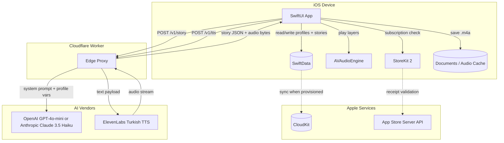
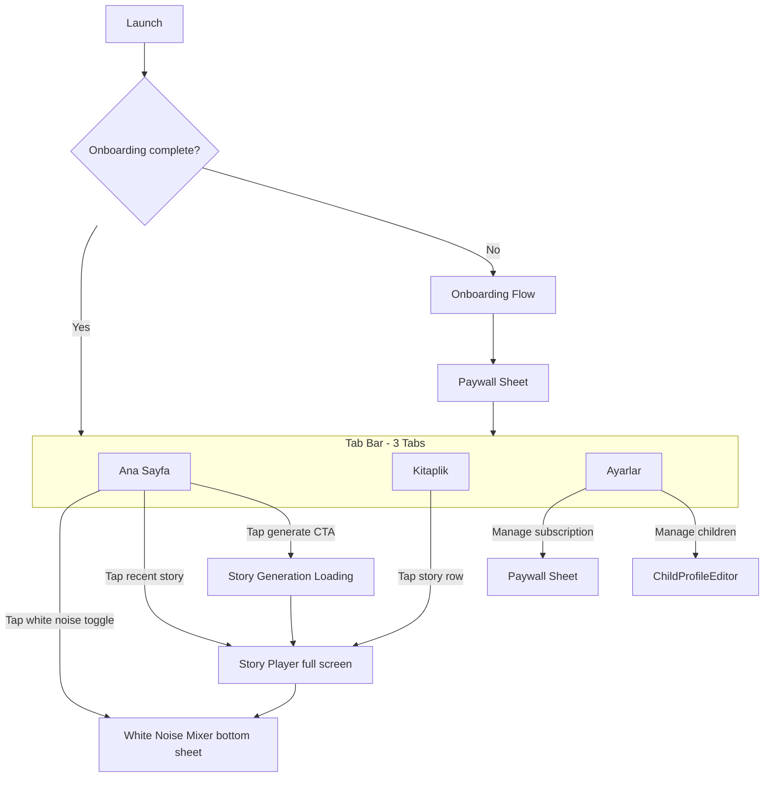

# Masal Amca — Definitive iOS Build Plan

## 1. Repository inventory

### Source documents


| Document                                                                           | Role                                                                                                                                                                                                                   |
| ---------------------------------------------------------------------------------- | ---------------------------------------------------------------------------------------------------------------------------------------------------------------------------------------------------------------------- |
| [Project Wiki: Masal Amca.md](Project%20Wiki:%20Masal%20Amca.md)                   | Product vision, target audience (Turkish parents, children 2-9), tech stack (SwiftUI/SwiftData/CloudKit), AI integration (OpenAI or Anthropic + ElevenLabs TTS), monetization (freemium subscriptions), unit economics |
| [iOSProjectOrchestrationPlan.md](iOSProjectOrchestrationPlan.md)                   | Battle-tested iOS agent patterns: folder layout, `.gitkeep` prohibition, test-target separation, SwiftData/CloudKit fallback, ThemeManager 10 commandments, `xcodebuild` gates, sprint discipline                      |
| [ProjectOrchestrationPlan.md](ProjectOrchestrationPlan.md)                         | Universal orchestrator framework; applicable portions: HITL gates, PROGRESS.md/ARCHITECTURE.md, security/PII rules, conventional commits                                                                               |
| [DesignProposal/midnight_fable/DESIGN.md](DesignProposal/midnight_fable/DESIGN.md) | **"The Dreamscape Narrative"** design system: Midnight palette, no-line rule, glass + gradient, Plus Jakarta Sans + Manrope, tonal layering, component specs, do's/don'ts                                              |


### Design reference screens (HTML/Tailwind prototypes)


| Screen                   | File                                                                        | Key elements to replicate                                                                                                                                                                                                                                                                                                                                                                                                                                                                  |
| ------------------------ | --------------------------------------------------------------------------- | ------------------------------------------------------------------------------------------------------------------------------------------------------------------------------------------------------------------------------------------------------------------------------------------------------------------------------------------------------------------------------------------------------------------------------------------------------------------------------------------ |
| **Home Dashboard**       | [home_dashboard/code.html](DesignProposal/home_dashboard/code.html)         | Top bar (avatar + "Masal Amca" + bell), greeting ("Iy Geceler, Can"), gradient hero CTA ("Bu Geceki Masali Uret"), horizontal "Son Dinlenenler" story cards (4:5 aspect, duration badge, genre label), "Hizli Beyaz Gurultu" quick-toggle row (Yagmur/Somine/Okyanus), "Gunun Ipucu" bento card, 3-tab bottom nav (Ana Sayfa / Kitaplik / Ayarlar)                                                                                                                                         |
| **Onboarding + Paywall** | [onboarding_paywall/code.html](DesignProposal/onboarding_paywall/code.html) | Hero illustration with blur halo, "Masal Amca'ya Hos Geldin" heading, form: child name input, 3-segment age picker (2-4 / 5-7 / 8+), multi-select theme chips (Hayvanlar / Uzay / Sihir / Masal Dunyasi), gradient "Devam Et" CTA; **Paywall overlay**: glass panel, gold "Premium Deneyim" badge, feature bento (unlimited stories, premium voices, CloudKit sync), pricing cards (Aylik ₺49.99 / Yillik ₺399.99 "EN POPULER"), "Ucretsiz Denemeyi Baslat" CTA (3-day trial), legal links |
| **Library**              | [library_view/code.html](DesignProposal/library_view/code.html)             | Top bar with cloud sync badge ("Bulut Eslendi"), search input, filter chips (Tumunu / Favoriler / Uyku / Macera), grouped list sections ("Son Dinlenenler" / "Eski Masallar"), row: 56pt thumbnail + title + cloud icon + duration + date + chevron, stats bento grid (Toplam Masal count + Dakika Dinlendi), active "Kitaplik" tab in bottom nav                                                                                                                                          |
| **Story Player + Mixer** | [story_player_mixer/code.html](DesignProposal/story_player_mixer/code.html) | Back arrow + "Masal Amca" + overflow menu, hero art (square, rounded), title + narrator + duration, voice visualizer bars, star progress scrubber (tertiary fill + glowing star indicator), playback controls (replay 10 / play-pause gradient circle / forward 30), **floating mixer panel**: drag handle, "Beyaz Gurultu Mikseri" header, per-sound rows (Yagmur / Anne Sss / Ruzgar) with icon + slider + toggle, no bottom nav (suppressed in active journey)                          |


### Existing Xcode project

The repo already contains a **default SwiftData template** at `MasalAmca/`:

- `MasalAmcaApp.swift` — `@main` entry with `ModelContainer` for `Item.self`
- `ContentView.swift` — `NavigationSplitView` boilerplate with `@Query` on `Item`
- `Item.swift` — single `@Model` with `timestamp: Date`
- `Info.plist` — `UIBackgroundModes: remote-notification` already set
- `MasalAmca.entitlements` — CloudKit enabled (container IDs array empty, needs provisioning), APS development environment set
- Asset catalog with empty AccentColor and AppIcon slots
- **No test targets** in the file listing (need to add `MasalAmcaTests` / `MasalAmcaUITests`)

This template will be **gutted and restructured** in Epic 1 -- the `Item` model, `ContentView`, and `NavigationSplitView` are replaced entirely.

---

## 2. Target architecture




### Trust boundary

- **API keys** (`OPENAI_API_KEY` / `ANTHROPIC_API_KEY`, `ELEVENLABS_API_KEY`) live **only** on the edge proxy as environment secrets.
- The iOS binary ships with only the **proxy base URL** (injected via XCConfig / build settings, not hardcoded strings).
- Future hardening: Apple DeviceCheck / App Attest token sent with every proxy request.

### Identity

- No custom login. User identity = Apple ID via CloudKit.
- CloudKit sync is **premium-only** (per wiki); free users store everything locally.

### Offline

- Generated audio files are cached in the app's documents directory (`FileManager.default.urls(for: .documentDirectory)`).
- Replay never hits TTS again.
- White noise loops are bundled in the app binary.

---

## 3. Navigation architecture (from mocks)




- **Bottom nav** uses the custom Dreamscape style: rounded top corners (`3rem`), glassmorphic background, active tab has `surfaceContainerHigh` pill + filled icon + bold label.
- Bottom nav is **suppressed** during the onboarding journey and the story player (per mocks).

---

## 4. Dreamscape design system (SwiftUI implementation)

### 4.1 Color tokens (complete mapping from HTML mocks)

All colors defined as `static let` on a `DreamscapeColors` struct (or in an asset catalog with programmatic access). **One mode: Midnight.** A future "Dusk" lighter variant can extend this.


| SwiftUI token             | Hex       | Usage                                            |
| ------------------------- | --------- | ------------------------------------------------ |
| `surface`                 | `#041329` | Root background, status bar area                 |
| `surfaceContainer`        | `#112036` | Nav blocks, list group backgrounds, bottom bar   |
| `surfaceContainerLow`     | `#0d1c32` | Input field backgrounds, recessed areas          |
| `surfaceContainerLowest`  | `#010e24` | Deepest recessed elements                        |
| `surfaceContainerHigh`    | `#1c2a41` | Cards, active tab pill, row hover                |
| `surfaceContainerHighest` | `#27354c` | Chips, elevated cards                            |
| `surfaceVariant`          | `#27354c` | Toggle track (off state)                         |
| `surfaceBright`           | `#2c3951` | Lighter surface variant                          |
| `onSurface`               | `#d6e3ff` | Primary text on dark backgrounds                 |
| `onSurfaceVariant`        | `#c9c4d5` | Secondary/caption text                           |
| `onBackground`            | `#d6e3ff` | Same as onSurface in midnight mode               |
| `primary`                 | `#c8bfff` | Interactive elements, active states, accent      |
| `primaryContainer`        | `#6a5acd` | Gradient start for CTAs, icon circles            |
| `onPrimary`               | `#2d128f` | Text on primary-colored surfaces                 |
| `onPrimaryContainer`      | `#f0ebff` | Text on gradient CTAs, icon on primary circle    |
| `primaryFixed`            | `#e5deff` | Headings like onboarding title                   |
| `secondary`               | `#b9c7e4` | Supporting text, inactive tab labels             |
| `secondaryContainer`      | `#3c4962` | Secondary button backgrounds                     |
| `onSecondary`             | `#233148` | Text on secondary                                |
| `tertiary`                | `#e9c400` | Star/gold accents, progress bars, reward moments |
| `tertiaryContainer`       | `#c9a900` | Tertiary button/badge backgrounds                |
| `onTertiary`              | `#3a3000` | Text on tertiary                                 |
| `outline`                 | `#928f9e` | Placeholder text, disabled elements              |
| `outlineVariant`          | `#474553` | Ghost borders at 15% opacity max                 |
| `error`                   | `#ffb4ab` | Error text                                       |
| `errorContainer`          | `#93000a` | Error backgrounds                                |


### 4.2 Typography


| Style           | Font              | Size (pt) | Weight    | Usage                                              |
| --------------- | ----------------- | --------- | --------- | -------------------------------------------------- |
| Display Large   | Plus Jakarta Sans | ~56pt     | ExtraBold | Story intro "Once upon a time"                     |
| Headline Medium | Plus Jakarta Sans | ~28pt     | Bold      | Story titles, screen titles                        |
| Title Medium    | Plus Jakarta Sans | ~18pt     | Bold      | Section headers, CTA text                          |
| Body Large      | Manrope           | ~16pt     | Regular   | Story reading text, descriptions (line-height 1.6) |
| Body Medium     | Manrope           | ~14pt     | Medium    | Row titles, card descriptions                      |
| Label Medium    | Manrope           | ~12pt     | SemiBold  | Metadata ("5 Dakika"), chip text, tab labels       |
| Label Small     | Manrope           | ~10pt     | Bold      | Duration badges, fine print                        |


Bundle both font families (Google Fonts OFL license) and register in `Info.plist` under `UIAppFonts`.

### 4.3 Shape and spacing

- **Corner radii:** `sm` = 8pt, `md` = 16pt (`1rem`), `lg` = 32pt, `xl` = 48pt. Cards and primary buttons use `lg`; bottom nav uses `xl` for top corners; chips use `full` (capsule).
- **Spacing scale:** Use multiples of 4pt. Major section gaps: 40pt (`space-y-10` equivalent). Card internal padding: 16-24pt.
- **No `Divider()` or 1px lines.** Use background tier shifts and whitespace.

### 4.4 Glass + gradient rules

- **Primary CTA:** `LinearGradient(colors: [.primaryContainer, .primary], startPoint: .topLeading, endPoint: .bottomTrailing)` with ambient shadow `Color(hex: "#6A5ACD").opacity(0.3)`, blur 32, y-offset 8.
- **Glass panels** (mixer, paywall): `surfaceContainerHigh.opacity(0.4)` background + `.blur(radius: 20)` via `UIVisualEffectView` wrapper or custom `Material`-like modifier tinted to palette. Do NOT use SwiftUI `.ultraThinMaterial` (follows system scheme, ignores custom tokens).
- **Ambient shadow** on floating elements: `Color(hex: "#6A5ACD").opacity(0.15)`, blur 24, y-offset 8.
- **Ghost border fallback:** `outlineVariant.opacity(0.15)` only when a container is lost against the background.

### 4.5 Reusable components to build in Epic 1


| Component          | Description                                                                                                                                       |
| ------------------ | ------------------------------------------------------------------------------------------------------------------------------------------------- |
| `GradientButton`   | Primary CTA: gradient fill, `xl` rounded corners, `onPrimaryContainer` text, haptic on tap, scale-down press animation                            |
| `GhostButton`      | Secondary CTA: transparent, `outlineVariant` at 20% border, `titleMedium` text                                                                    |
| `StoryCard`        | Vertical card: image (4:5 aspect), duration badge overlay (blur pill), title + genre label below. `surfaceContainerHigh` background, `lg` corners |
| `GenreChip`        | Capsule: `surfaceContainerHighest` fill (selected: `surfaceContainerHighest` + `primary` border), icon + label                                    |
| `StarProgressBar`  | Horizontal track: `surfaceContainer` background, `tertiary` fill, trailing `star.fill` SF Symbol with glow shadow                                 |
| `GlassPanel`       | Frosted container: tinted blur background, ghost border, drag handle bar                                                                          |
| `WhiteNoiseRow`    | Row: icon circle + name + slider + toggle switch                                                                                                  |
| `StoryListRow`     | Row: 56pt thumbnail + title + cloud badge + duration + date + chevron                                                                             |
| `DreamscapeTabBar` | Custom tab bar: `surfaceContainer` with blur, `xl` top corners, active pill, 3 items                                                              |
| `InputField`       | `surfaceContainerLow` background, `primary` focus ring glow, placeholder in `outline` color                                                       |


### 4.6 Icons

Use **SF Symbols** in **regular** or **light** weight (not fill-heavy). Map from Material Symbols in mocks:


| Mock icon                  | SF Symbol                        |
| -------------------------- | -------------------------------- |
| `auto_awesome`             | `sparkles`                       |
| `library_books`            | `books.vertical`                 |
| `settings`                 | `gearshape`                      |
| `water_drop`               | `drop.fill`                      |
| `fireplace`                | `flame`                          |
| `waves`                    | `water.waves`                    |
| `air`                      | `wind`                           |
| `record_voice_over`        | `mouth`                          |
| `schedule` / `star`        | `clock` / `star.fill`            |
| `notifications`            | `bell`                           |
| `account_circle`           | `person.circle`                  |
| `arrow_back_ios`           | `chevron.left`                   |
| `replay_10` / `forward_30` | `gobackward.10` / `goforward.30` |
| `pause` / `play_arrow`     | `pause.fill` / `play.fill`       |
| `cloud`                    | `cloud.fill`                     |
| `search`                   | `magnifyingglass`                |
| `chevron_right`            | `chevron.right`                  |


### 4.7 Transitions and animations

- Screen transitions: **soft cross-dissolve** or **slide from trailing**, never hard snaps.
- Button press: `scaleEffect(0.95)` with 200ms spring.
- Story card hover/press: image `scaleEffect(1.05)` over 500ms.
- Voice visualizer: animated bar heights on a `TimelineView(.animation)`.
- Star on progress bar: subtle glow pulse (`shadow` radius oscillation).
- Haptic feedback: `.impact(.light)` on button taps, `.selection` on toggle changes.

---

## 5. Data model (SwiftData)

### ChildProfile

```swift
@Model final class ChildProfile {
    @Attribute(.unique) var id: UUID
    var name: String
    var ageGroup: AgeGroup          // enum: twoToFour, fiveToSeven, eightPlus
    var themes: [StoryTheme]        // enum: animals, space, magic, fairyTale
    var behavioralGoals: [String]   // free-form: "sharing", "courage"
    var createdAt: Date
    var updatedAt: Date

    @Relationship(deleteRule: .cascade, inverse: \Story.profile)
    var stories: [Story]
}
```

### Story

```swift
@Model final class Story {
    @Attribute(.unique) var id: UUID
    var profile: ChildProfile?
    var title: String               // Turkish title from LLM
    var body: String                // Full Turkish story text
    var durationSeconds: Int        // From ElevenLabs audio length
    var audioFileName: String?      // Relative path in documents dir
    var isFavorite: Bool
    var genre: StoryGenre           // enum: calming, adventure, educational
    var generationModel: String     // "gpt-4o-mini" or "claude-3.5-haiku"
    var createdAt: Date
}
```

### Enums (all `String, Codable, CaseIterable`)

```swift
enum AgeGroup: String, Codable, CaseIterable {
    case twoToFour = "2-4"
    case fiveToSeven = "5-7"
    case eightPlus = "8+"
    var displayName: String { rawValue }
}

enum StoryTheme: String, Codable, CaseIterable {
    case animals, space, magic, fairyTale
    var displayName: String { /* Turkish names: Hayvanlar, Uzay, Sihir, Masal Dunyasi */ }
    var iconName: String { /* SF Symbol name */ }
}

enum StoryGenre: String, Codable, CaseIterable {
    case calming, adventure, educational
    var displayName: String { /* Turkish: Sakinlestirici, Macera, Egitici */ }
}
```

### ModelContainer setup (with CloudKit fallback)

```swift
let schema = Schema([ChildProfile.self, Story.self])
let cloudConfig = ModelConfiguration(schema: schema, isStoredInMemoryOnly: false, cloudKitDatabase: .automatic)
if let container = try? ModelContainer(for: schema, configurations: [cloudConfig]) {
    return container
}
let localConfig = ModelConfiguration(schema: schema, isStoredInMemoryOnly: false, cloudKitDatabase: .none)
return try ModelContainer(for: schema, configurations: [localConfig])
```

### ChildProfileManager (multi-child support from day one)

```swift
@Observable @MainActor
final class ChildProfileManager {
    var activeProfileID: UUID? {
        didSet { UserDefaults.standard.set(activeProfileID?.uuidString, forKey: "active_profile_id") }
    }
    func activeProfile(from profiles: [ChildProfile]) -> ChildProfile? { ... }
    func switchTo(_ profile: ChildProfile) { activeProfileID = profile.id }
}
```

Injected via `.environment()` at app root. Supports profile switcher in Settings and "add child" flow.

---

## 6. Edge proxy API contract

### `POST /v1/story`

**Request:**

```json
{
  "child_name": "Can",
  "age_group": "5-7",
  "themes": ["animals", "magic"],
  "behavioral_goal": "sharing",
  "language": "tr"
}
```

**Response:**

```json
{
  "title": "Paylasimci Kedi Minnos",
  "body": "Bir varmis bir yokmus...",
  "genre": "educational",
  "word_count": 480,
  "model": "gpt-4o-mini"
}
```

Server-side system prompt enforces: Turkish language, age-appropriate vocabulary, non-violent, pedagogically safe, ~400-600 words, child is the hero.

### `POST /v1/tts`

**Request:**

```json
{
  "text": "Bir varmis bir yokmus...",
  "voice_id": "turkish_warm_male",
  "output_format": "mp3_44100_128"
}
```

**Response:** Binary audio stream (mp3 or m4a).

### Security

- Shared secret in `Authorization: Bearer <token>` header (MVP).
- Rate limit: 10 requests/minute per device identifier hash.
- No PII logging: child names are redacted before any server-side logs.
- `.env.example`:

```
  OPENAI_API_KEY=sk-...
  ELEVENLABS_API_KEY=xi-...
  ELEVENLABS_VOICE_ID=...
  PROXY_AUTH_TOKEN=...
  

```

---

## 7. Epic breakdown with sprint-level detail

### Epic 1 — Foundation (Sprint 1)

**Goal:** Restructured Xcode project, full Dreamscape theme, all reusable components, tab shell, builds green.


| Ticket                   | Deliverables                                                                                                                                                                                                                                                                                                                                               |
| ------------------------ | ---------------------------------------------------------------------------------------------------------------------------------------------------------------------------------------------------------------------------------------------------------------------------------------------------------------------------------------------------------- |
| E1.1 Restructure folders | Create `App/`, `Models/`, `Models/Enums/`, `Data/`, `Views/Onboarding/`, `Views/Dashboard/`, `Views/Library/`, `Views/Player/`, `Views/Mixer/`, `Views/Settings/`, `Views/Components/`, `Theme/`, `Services/`, `Resources/`, `Utilities/` under `MasalAmca/MasalAmca/`. Delete `Item.swift`, gut `ContentView.swift`. Add test targets outside app folder. |
| E1.2 Bundle fonts        | Download Plus Jakarta Sans (700, 800) + Manrope (400, 500, 600) `.ttf` files into `Resources/Fonts/`. Register in Info.plist. Create `Typography.swift` with semantic styles.                                                                                                                                                                              |
| E1.3 DreamscapeColors    | `Theme/DreamscapeColors.swift` with all 30+ color tokens as `static let`.                                                                                                                                                                                                                                                                                  |
| E1.4 ThemeManager        | `@Observable` ThemeManager with `currentMode` (midnight only for now). Inject at app root. Follow all 10 commandments from iOS orchestration doc.                                                                                                                                                                                                          |
| E1.5 DesignTokens        | `Theme/DesignTokens.swift` — spacing scale, corner radii, shadow definitions.                                                                                                                                                                                                                                                                              |
| E1.6 Reusable components | Build all components from section 4.5 above in `Views/Components/`.                                                                                                                                                                                                                                                                                        |
| E1.7 Tab shell           | `DreamscapeTabBar` + `MainTabView` with 3 tabs (placeholder content). Replace `NavigationSplitView`.                                                                                                                                                                                                                                                       |
| E1.8 App entry           | Rewrite `MasalAmcaApp.swift`: new ModelContainer, inject ThemeManager + ChildProfileManager, set `.preferredColorScheme(.dark)`.                                                                                                                                                                                                                           |


**Build gate:** `xcodebuild build` succeeds.

### Epic 2 — Data Layer (Sprint 2)


| Ticket                   | Deliverables                                                               |
| ------------------------ | -------------------------------------------------------------------------- |
| E2.1 Models              | `ChildProfile.swift`, `Story.swift`, all enums in `Models/Enums/`.         |
| E2.2 Repository          | `Data/SwiftDataManager.swift` (`@ModelActor` with generic CRUD).           |
| E2.3 ChildProfileManager | `Data/ChildProfileManager.swift`, injected at root.                        |
| E2.4 CloudKit fallback   | Update `MasalAmcaApp` ModelContainer with try-CloudKit-then-local pattern. |
| E2.5 Unit tests          | `MasalAmcaTests/` — test model creation, fetch, delete, profile switching. |


**Build + test gate.**

### Epic 3 — Edge Proxy (Sprint 3, parallel track)


| Ticket                          | Deliverables                                                                                       |
| ------------------------------- | -------------------------------------------------------------------------------------------------- |
| E3.1 Worker scaffold            | `edge/` directory: `wrangler.toml`, `src/index.ts`, `package.json`.                                |
| E3.2 `/v1/story` endpoint       | Receives profile vars, calls OpenAI/Anthropic with Turkish system prompt, returns structured JSON. |
| E3.3 `/v1/tts` endpoint         | Receives text, calls ElevenLabs, streams audio back.                                               |
| E3.4 Auth + rate limiting       | Validate `Authorization` header, enforce per-device rate limits via KV store.                      |
| E3.5 .env.example + deploy docs | Document deployment, env vars, Wrangler commands.                                                  |


**Gate:** `wrangler dev` runs, curl tests pass.

### Epic 4 — Onboarding + Paywall (Sprint 4)


| Ticket                   | Deliverables                                                                                                                                                                                                                                                   |
| ------------------------ | -------------------------------------------------------------------------------------------------------------------------------------------------------------------------------------------------------------------------------------------------------------- |
| E4.1 Welcome page        | Hero illustration (bundled asset or generated), "Masal Amca'ya Hos Geldin" title, subtitle, "Devam Et" CTA.                                                                                                                                                    |
| E4.2 Profile form        | Child name `InputField`, 3-segment age picker, theme chips (multi-select). Match onboarding_paywall mock layout.                                                                                                                                               |
| E4.3 Persistence         | Save `ChildProfile` to SwiftData on "Devam Et". Set `UserDefaults` `onboarding_complete`.                                                                                                                                                                      |
| E4.4 Paywall modal       | Glass panel overlay: "Premium Deneyim" gold badge, 3 feature rows (unlimited stories, premium voices, CloudKit sync), monthly/yearly pricing cards, "Ucretsiz Denemeyi Baslat" CTA, legal fine print. Wire to StoreKit products (can be stubbed until Epic 7). |
| E4.5 Conditional routing | App entry checks `onboarding_complete`; routes to onboarding or tab shell.                                                                                                                                                                                     |


**Build gate.**

### Epic 5 — Story Generation + Playback (Sprints 5-6)

**Sprint 5 — Home + Generation:**


| Ticket                   | Deliverables                                                                                                                                                                                                                                                     |
| ------------------------ | ---------------------------------------------------------------------------------------------------------------------------------------------------------------------------------------------------------------------------------------------------------------- |
| E5.1 Home dashboard      | `Views/Dashboard/HomeView.swift`: greeting with child name ("Iy Geceler, {name}"), subtitle, gradient hero CTA ("Bu Geceki Masali Uret"), "Son Dinlenenler" horizontal scroll of `StoryCard`s, "Hizli Beyaz Gurultu" quick-toggle row, "Gunun Ipucu" bento card. |
| E5.2 StoryService        | `Services/StoryService.swift`: networking layer calling proxy `/v1/story` + `/v1/tts`. Returns `StoryGenerationResult` (text + audio data). Handles loading/error/retry.                                                                                         |
| E5.3 Prompt orchestrator | `Services/PromptOrchestrator.swift`: maps active `ChildProfile` fields to proxy request JSON.                                                                                                                                                                    |
| E5.4 Audio cache         | `Services/AudioCacheManager.swift`: save audio `Data` to documents dir as `.m4a`, return file URL. Check existence before re-downloading.                                                                                                                        |
| E5.5 Generation flow     | Tap CTA -> loading sheet (sparkle animation) -> on success: create `Story` in SwiftData, cache audio, navigate to player. On error: themed error alert with retry.                                                                                               |


**Sprint 6 — Player + Library:**


| Ticket                  | Deliverables                                                                                                                                                                                                                                 |
| ----------------------- | -------------------------------------------------------------------------------------------------------------------------------------------------------------------------------------------------------------------------------------------- |
| E5.6 Story player       | `Views/Player/StoryPlayerView.swift`: full-screen, hero art (gradient overlay), title + narrator + duration, voice visualizer bars (animated), `StarProgressBar` as scrubber, playback controls (gobackward.10 / play-pause / goforward.30). |
| E5.7 AudioPlayerService | `Services/AudioPlayerService.swift`: `AVAudioSession` category `.playback`, `AVAudioPlayer` for story audio, play/pause/seek, track current time, publish to `MPNowPlayingInfoCenter` + `MPRemoteCommandCenter`.                             |
| E5.8 Background audio   | Add `audio` to `UIBackgroundModes` in Info.plist (alongside existing `remote-notification`).                                                                                                                                                 |
| E5.9 Library view       | `Views/Library/LibraryView.swift`: search bar, filter chips, grouped `StoryListRow`s by date sections, stats bento (total stories + minutes listened), cloud sync badge in nav.                                                              |
| E5.10 Story detail      | Tap row -> navigate to `StoryPlayerView` with selected story. Swipe-to-delete on rows. Favorite toggle.                                                                                                                                      |


**Build gate.**

### Epic 6 — White Noise Mixer (Sprint 7)


| Ticket                    | Deliverables                                                                                                                                                                                              |
| ------------------------- | --------------------------------------------------------------------------------------------------------------------------------------------------------------------------------------------------------- |
| E6.1 Audio loops          | Bundle 6+ ambient loops in `Resources/Audio/`: rain, fireplace, ocean, wind, shush ("Anne Sss"), fan. Use high-quality AAC. Free tier: 3 (rain, ocean, wind). Premium: all.                               |
| E6.2 MixerEngine          | `Services/MixerEngine.swift`: `AVAudioEngine` with multiple `AVAudioPlayerNode`s, one per loop. Per-node volume control (0.0-1.0). Master volume. Loop seamlessly.                                        |
| E6.3 Mixer UI             | `Views/Mixer/WhiteNoiseMixerView.swift`: `GlassPanel` bottom sheet, drag handle, "Beyaz Gurultu Mikseri" header, list of `WhiteNoiseRow`s (icon + name + slider + toggle). Match story_player_mixer mock. |
| E6.4 Quick toggles        | Home dashboard "Hizli Beyaz Gurultu" section: tap a sound -> toggle it in the mixer engine, update toggle state.                                                                                          |
| E6.5 Post-story crossfade | Option: when story audio ends, fade mixer volume from 0 to user's set levels over 5 seconds.                                                                                                              |
| E6.6 Sleep timer          | Circular timer control: presets (15/30/45/60 min), fade-out-and-stop all audio when timer expires. Haptic tick on dial rotation.                                                                          |


**Build gate.**

### Epic 7 — Monetization (Sprint 8)


| Ticket                   | Deliverables                                                                                                                                                                   |
| ------------------------ | ------------------------------------------------------------------------------------------------------------------------------------------------------------------------------ |
| E7.1 StoreKit 2 setup    | `Services/SubscriptionManager.swift`: `@Observable`, listen to `Transaction.updates`, expose `isPremium` computed property. Product IDs for monthly + yearly.                  |
| E7.2 Free tier quota     | Track `storiesGeneratedCount` in `UserDefaults` (or SwiftData settings model). Gate: if count >= 2 and not premium -> show paywall. Gate premium sounds similarly.             |
| E7.3 Paywall integration | Wire Epic 4's paywall modal to real `Product.purchase()`. Handle `.success`, `.pending`, `.userCancelled`.                                                                     |
| E7.4 Restore purchases   | Button in Settings: calls `AppStore.sync()`, refreshes entitlements.                                                                                                           |
| E7.5 Entitlement gating  | Generate CTA: check quota or premium. Premium sounds: check entitlement before toggling. CloudKit sync: conditionally enable based on premium (or always enable -- your call). |


**Build gate.**

### Epic 8 — Polish + Ship (Sprint 9)


| Ticket                             | Deliverables                                                                                                                                                                |
| ---------------------------------- | --------------------------------------------------------------------------------------------------------------------------------------------------------------------------- |
| E8.1 Accessibility                 | VoiceOver labels on all interactive elements, Dynamic Type support, minimum 44pt touch targets, Reduce Motion alternatives for animations.                                  |
| E8.2 Empty states                  | Themed empty states for: library (no stories yet), home recent (no stories), search no results.                                                                             |
| E8.3 Loading states                | Skeleton/shimmer for story generation, network fetches.                                                                                                                     |
| E8.4 Settings screen               | `Views/Settings/SettingsView.swift`: manage children (list + add + edit + delete), subscription status + manage, theme preference (future), about/legal, restore purchases. |
| E8.5 Info.plist                    | All required usage descriptions: `NSMicrophoneUsageDescription` (if ever needed), background modes complete.                                                                |
| E8.6 App icon                      | Design and set 1024x1024 icon in asset catalog.                                                                                                                             |
| E8.7 MANUAL_TESTING.md             | 200+ test cases organized by screen/feature (per iOS orchestration doc).                                                                                                    |
| E8.8 PROGRESS.md + ARCHITECTURE.md | Living docs updated with final state.                                                                                                                                       |


**Build + test gate. Commit as release candidate.**

---

## 8. Xcode folder structure (target state)

```
MasalAmca/
  MasalAmca.xcodeproj/
  MasalAmca/                     (app target)
    App/
      MasalAmcaApp.swift
    Models/
      ChildProfile.swift
      Story.swift
      Enums/
        AgeGroup.swift
        StoryTheme.swift
        StoryGenre.swift
    Data/
      SwiftDataManager.swift
      ChildProfileManager.swift
    Views/
      Onboarding/
        OnboardingView.swift
        OnboardingFormView.swift
        PaywallView.swift
      Dashboard/
        HomeView.swift
      Library/
        LibraryView.swift
        StoryListRow.swift
      Player/
        StoryPlayerView.swift
        VoiceVisualizerView.swift
      Mixer/
        WhiteNoiseMixerView.swift
        WhiteNoiseRow.swift
      Settings/
        SettingsView.swift
        ChildProfileEditorView.swift
      Components/
        GradientButton.swift
        GhostButton.swift
        StoryCard.swift
        GenreChip.swift
        StarProgressBar.swift
        GlassPanel.swift
        InputField.swift
        DreamscapeTabBar.swift
    Theme/
      DreamscapeColors.swift
      Typography.swift
      DesignTokens.swift
      ThemeManager.swift
    Services/
      StoryService.swift
      PromptOrchestrator.swift
      AudioPlayerService.swift
      AudioCacheManager.swift
      MixerEngine.swift
      SubscriptionManager.swift
    Utilities/
      Extensions.swift
    Resources/
      Fonts/
        PlusJakartaSans-Bold.ttf
        PlusJakartaSans-ExtraBold.ttf
        Manrope-Regular.ttf
        Manrope-Medium.ttf
        Manrope-SemiBold.ttf
      Audio/
        rain.m4a
        fireplace.m4a
        ocean.m4a
        wind.m4a
        shush.m4a
        fan.m4a
    Assets.xcassets/
    Info.plist
    MasalAmca.entitlements
  MasalAmcaTests/                (OUTSIDE app folder)
    ModelTests.swift
    RepositoryTests.swift
    PromptOrchestratorTests.swift
    SubscriptionManagerTests.swift
  MasalAmcaUITests/
    OnboardingUITests.swift
    LibraryUITests.swift
edge/                            (serverless proxy)
  src/
    index.ts
  wrangler.toml
  package.json
  .env.example
```

**No `.gitkeep` files anywhere** under the app target folder.

---

## 9. Testing strategy


| Layer           | What                                                                                                                                                   | How                                                                                       |
| --------------- | ------------------------------------------------------------------------------------------------------------------------------------------------------ | ----------------------------------------------------------------------------------------- |
| **Unit**        | Model creation + relationships, ChildProfileManager switching, PromptOrchestrator output, SubscriptionManager gating logic, AudioCacheManager file ops | XCTest in `MasalAmcaTests` target. Mock network with protocol-based dependency injection. |
| **UI**          | Onboarding happy path, paywall display, library navigation, player controls                                                                            | XCUITest in `MasalAmcaUITests` target. Stub proxy responses.                              |
| **Integration** | Full flow: generate story -> play -> cache -> replay offline                                                                                           | Manual via `MANUAL_TESTING.md` + TestFlight on device.                                    |
| **Edge proxy**  | Endpoint responses, rate limiting, auth rejection                                                                                                      | `wrangler dev` + curl scripts or Vitest in `edge/`.                                       |


---

## 10. Human-in-the-loop gates


| Gate                             | When                           | What you must do                                                                                           |
| -------------------------------- | ------------------------------ | ---------------------------------------------------------------------------------------------------------- |
| **HITL-1: xcode-select**         | Before any `xcodebuild`        | Run `sudo xcode-select -s /Applications/Xcode.app/Contents/Developer`                                      |
| **HITL-2: Design review**        | After Epic 1                   | Run app on device/simulator, compare to HTML mocks, approve colors/type/layout                             |
| **HITL-3: Apple Developer**      | Before Epic 2 CloudKit testing | Create CloudKit container in Apple Developer portal, add container ID to entitlements                      |
| **HITL-4: AI provider accounts** | Before Epic 3                  | Create OpenAI or Anthropic account + ElevenLabs account, select Turkish voice ID, set billing limits       |
| **HITL-5: Deploy proxy**         | After Epic 3                   | `wrangler deploy`, set secrets via `wrangler secret put`                                                   |
| **HITL-6: StoreKit products**    | Before Epic 7                  | Create subscription group + products in App Store Connect (or use StoreKit Configuration file for testing) |
| **HITL-7: App Store listing**    | Before release                 | App Store Connect listing, screenshots, privacy nutrition label, age rating (4+ with parental gate)        |
| **HITL-8: Legal**                | Before release                 | KVKK/GDPR privacy policy, terms of use, children's data handling disclosure                                |
| **HITL-9: TestFlight**           | Before release                 | Distribute beta, test CloudKit sync on 2 devices, test background audio on lock screen                     |


---

## 11. Key risks and mitigations


| Risk                                     | Impact                                       | Mitigation                                                                                                                               |
| ---------------------------------------- | -------------------------------------------- | ---------------------------------------------------------------------------------------------------------------------------------------- |
| **ElevenLabs TTS cost**                  | ~$0.05-0.09 per story; scales with user base | Aggressive audio caching (replay is free); daily generation cap even for premium; server-side rate limiting; monitor usage dashboard     |
| **CloudKit not provisioned**             | App crashes on launch                        | Always-on local fallback pattern (section 5); CloudKit is a premium upsell, not a launch blocker                                         |
| **App Review rejection (kids category)** | Delayed launch                               | No external account creation; clear "parental use" framing; AI-generated content disclosure; no ads; no third-party trackers; COPPA-safe |
| **API key exposure**                     | Financial abuse                              | Keys only on edge proxy; DeviceCheck/App Attest in future; proxy rate limits; billing alerts on provider dashboards                      |
| **ElevenLabs voice quality in Turkish**  | User experience                              | Test multiple voice IDs during HITL-4; have fallback voice; consider Apple `AVSpeechSynthesizer` as degraded fallback for offline        |
| **Large audio files**                    | Storage pressure                             | Cap story length (~500 words / ~3 min); compress to 128kbps AAC; offer "delete audio, keep text" in library                              |


---

## 12. Build verification protocol (every sprint)

After each epic/sprint completes:

1. Discover available simulator: `xcodebuild -scheme MasalAmca -showdestinations 2>&1 | grep "iOS Simulator"`
2. Build: `xcodebuild build -scheme MasalAmca -destination 'platform=iOS Simulator,name=<discovered>' -skipPackagePluginValidation 2>&1 | grep -E "error:|BUILD"`
3. If **BUILD FAILED**: read errors, fix, rebuild. Never commit broken code.
4. If **BUILD SUCCEEDED**: run tests (when test target exists), then commit:

```
   git add -A && git commit -m "feat(epicN): Sprint description" && git push origin main
   

```

1. Update `PROGRESS.md` with completed tickets and test status.

---

## 13. Definition of done

- App builds and all tests pass on `xcodebuild`
- Onboarding collects child profile and persists to SwiftData
- Story generation via proxy returns Turkish text + ElevenLabs audio
- Audio cached locally; offline replay works without network
- Story player with visualizer, star scrubber, lock screen controls
- White noise mixer layers multiple sounds with per-layer volume
- Sleep timer fades out and stops all audio
- Post-story crossfade from narration to white noise
- Freemium gating: 2 free stories, 3 free sounds; paywall for premium
- StoreKit 2 subscriptions (monthly/yearly) with restore
- Library with search, filter, grouped list, stats bento
- Multi-child profiles with switcher
- CloudKit sync works on 2 devices when container provisioned (graceful fallback otherwise)
- All screens match Dreamscape design system (no system colors, no divider lines, gradient CTAs, custom fonts)
- Accessibility: VoiceOver, Dynamic Type, 44pt touch targets
- Edge proxy deployed with secrets; iOS binary contains no API keys
- `MANUAL_TESTING.md` with 200+ test cases
- `PROGRESS.md` and `ARCHITECTURE.md` current

